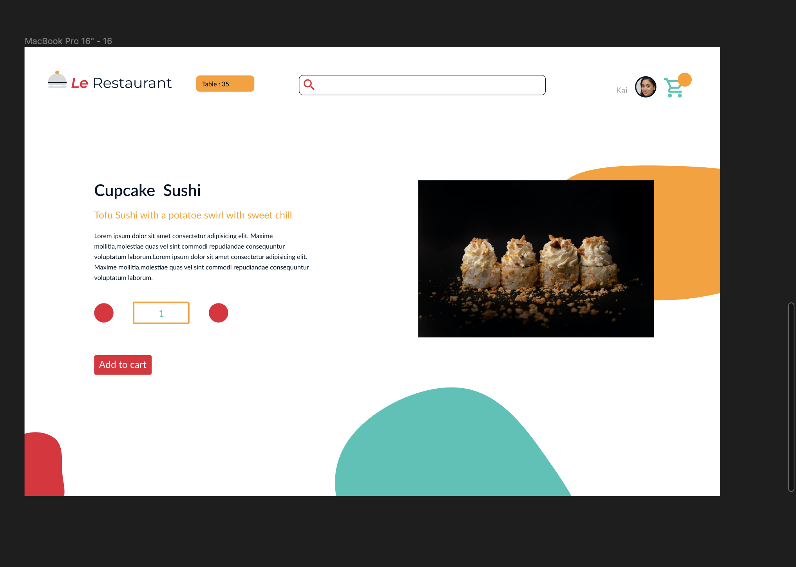
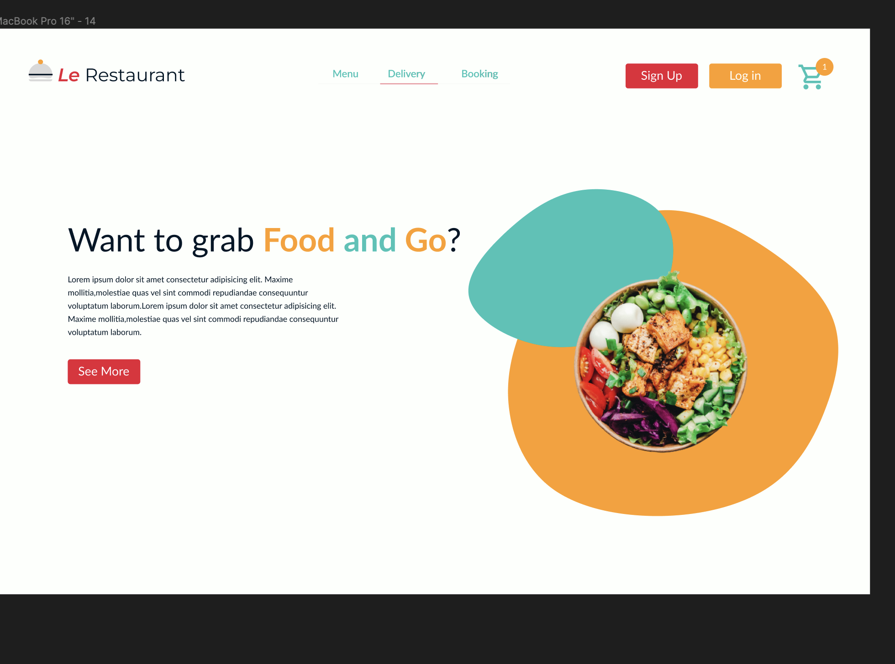
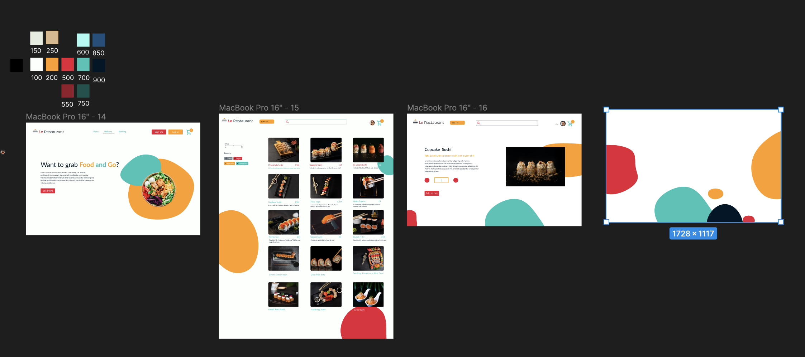
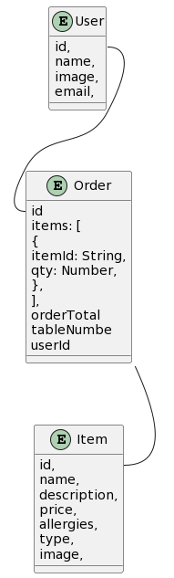

Welcome to My synoptic project :wave:

Tech Stack:
NextJS
Chakra UI
Redux
Cypress
Jest
Axios
React-Hook-Form

Design:

I have designed through figma buiding wireframe and UI.
Here access to my figma via `https://www.figma.com/file/WwYNubn1K0lPY1Osd4Omp7/Les-restaurant?node-id=0%3A1`

## Screenshots







## UML

Here is the uml


```
@startuml Restaurants

entity User {
     id,
  name,
  image,
  email,
}
entity Item {
      id,
  name,
  description,
  price,
  allergies,
  type,
  image,
}


entity Order {
    id
     items: [
    {
      itemId: String,
      qty: Number,
    },
  ],
  orderTotal
  tableNumbe
  userId
}


User::id -- Order::id
Order::order_id -- Item::id

@enduml

```
