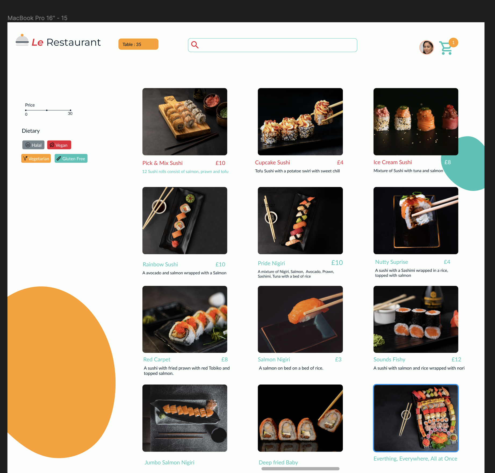
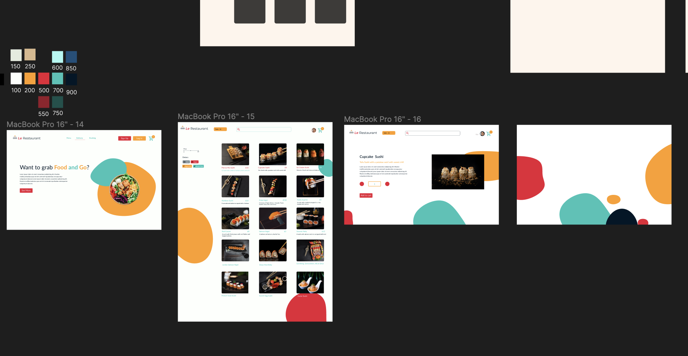
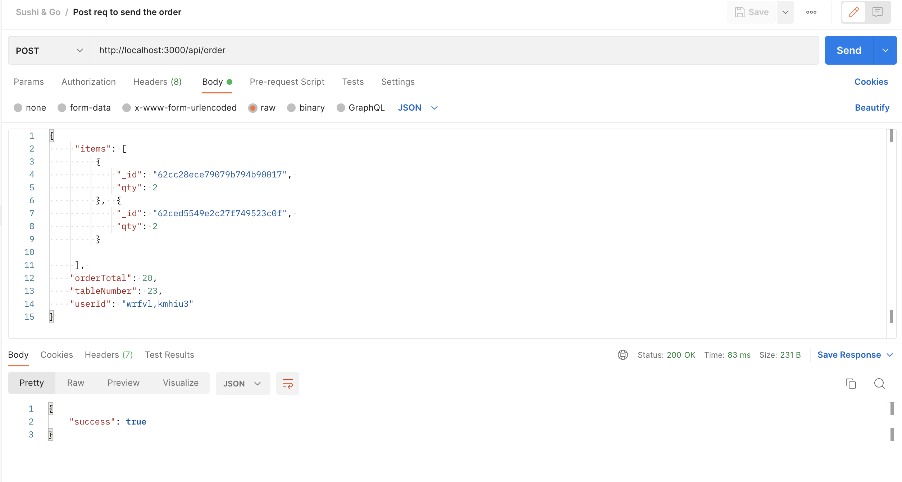
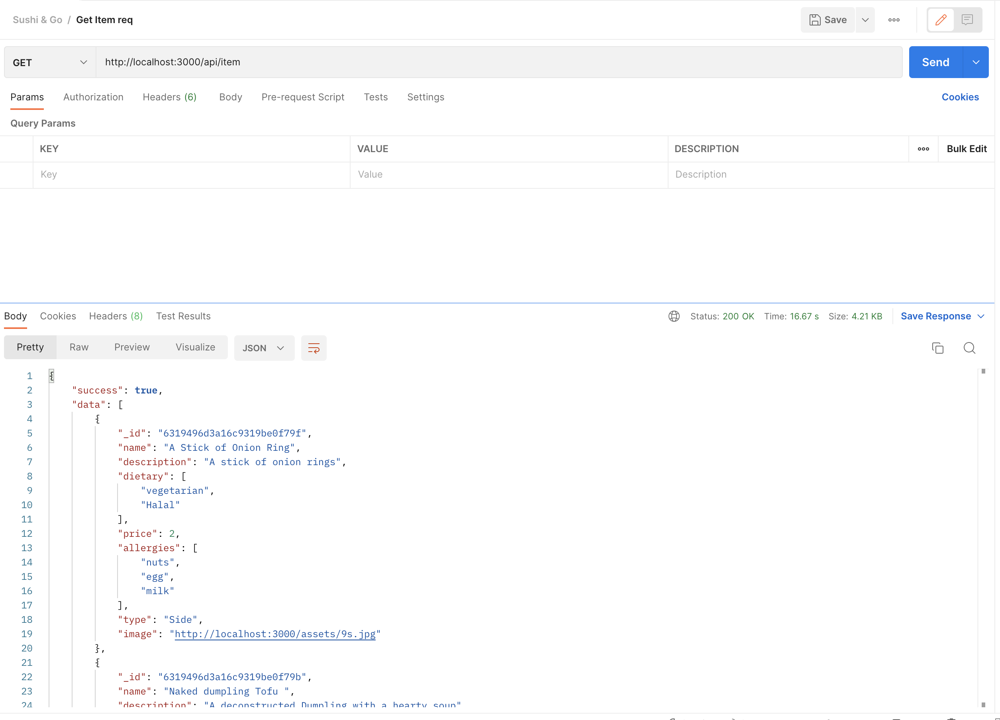
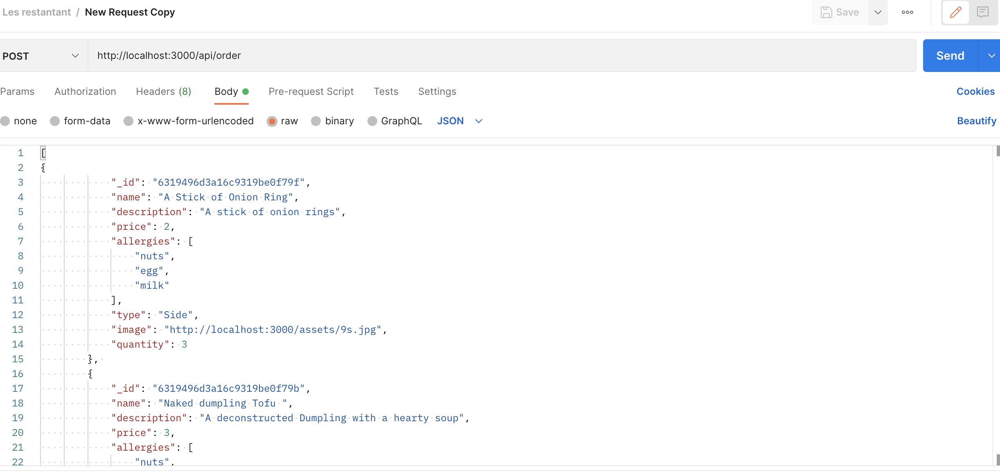

# Welcome to My synoptic project :wave:

## Tech Stack:

- NextJS
- Chakra UI
- Redux
- Cypress
- Jest
- Axios
- React-Hook-Form

# Run the app

To run the local version

```
yarn run dev
```

To vist the deploy

```
https://hoda-mire-le-restaurants.vercel.app/
```

# Design:

I have designed through figma buiding wireframe and UI.
Here access to my figma via <a>`https://www.figma.com/file/WwYNubn1K0lPY1Osd4Omp7/Les-restaurant?node-id=0%3A1`</a>

## Screenshots







## UML

Here is the uml


```

@startuml Restaurants

entity User {
id,
name,
image,
email,
}
entity Item {
id,
name,
description,
price,
allergies,
type,
image,
}

entity Order {
id
items: [
{
itemId: String,
qty: Number,
},
],
orderTotal
tableNumbe
userId
}

User::id -- Order::id
Order::order_id -- Item::id

@enduml

```

# Testing

Testing using Postman and Jest and cypress




```
